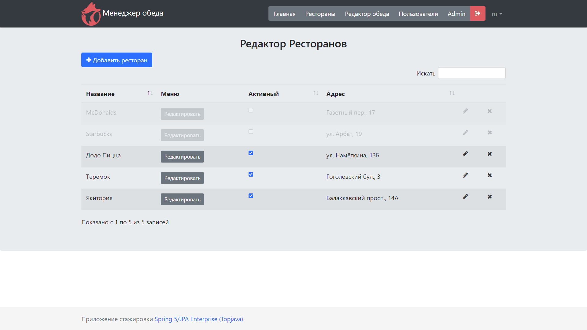
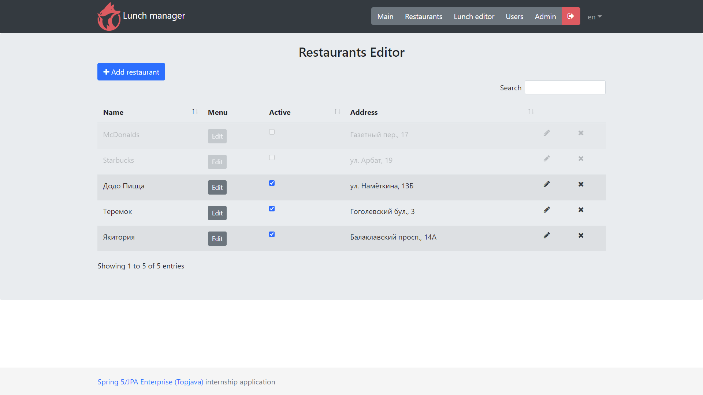

**RU** | [EN](README_EN.md)

Менеджер обеда
===============================
[](https://www.codacy.com/gh/vladislav1is/lunch-manager-reboot/dashboard?utm_source=github.com&amp;utm_medium=referral&amp;utm_content=vladislav1is/lunch-manager-reboot&amp;utm_campaign=Badge_Grade)

**Выпускной проект стажировки** [Java Online Projects](https://javaops.ru/view/topjava)
- Исходный код взят из **TopJava**;
- **Менеджер обеда** выполнялся на основе этого репозитория;
- Запустить в корневом каталоге: **mvn spring-boot:run**.

-----
## Задание
Разработать проект Java Enterprise с регистрацией / авторизацией и правами доступа согласно ролям (USER, ADMIN, R_ADMIN). 
Внедрить JSON API с помощью Spring Data JPA / Hibernate / Spring MVC (или Spring Boot).
Все REST интерфейсы покрыть тестами JUnit с помощью Spring MVC Test и Spring Security Test.

> **Build a voting system for deciding where to have lunch.**
>* 2 types of users: admin and regular users
>* Admin can input a restaurant and it's lunch menu of the day (2-5 items usually, just a dish name and price)
>* Menu changes each day (admins do the updates)
>* Users can vote on which restaurant they want to have lunch at
>* Only one vote counted per user
>* If user votes again the same day:
>   - If it is before 11:00 we assume that he changed his mind.
>   - If it is after 11:00 then it is too late, vote can't be changed
>
>Each restaurant provides new menu every day.
>
>As a result, provide a link to github repository. It should contain the code, README.md with API documentation and couple curl commands to test it.

P.S.: Предположим, что API будет использоваться разработчиком внешнего интерфейса для создания внешнего интерфейса
поверх этого.

-----
## Реализация
Система голосования помогает выбрать место для обеда.
**Каждый ресторан предлагает новое меню каждый день.**

> * **3 типа пользователей: админ, менеджер и обычный пользователь**
>* Администратор и Менеджер могут ввести ресторан и меню дня (обычно 2-5 пунктов)
>* Менеджер отвечает только за свои рестораны
>* Администратор может создавать/редактировать/удалять пользователей
>* Пользователь может управлять данными своего профиля через пользовательский интерфейс (AJAX) и REST с базовой авторизацией
>* **Меню меняется каждый день (обновления делают админы)**
>* Обеды можно отфильтровать по дате
>* Пользователь может выбрать ресторан в котором будет обедать
>* **Только один голос засчитывается для каждого пользователя**
>* Если пользователь голосует снова в тот же день:
>   - Если **до 11:00**, мы предполагаем, что он передумал
>   - Если **после 11:00** уже поздно, голос не может быть изменен
>* Цвет строки ресторанов **зависит от ежедневного голосования пользователя (параметр ресторана)**

#### Restaurant - Ресторан
Информация о ресторане.
> Нельзя создать два ресторана с одним названием и адресом.

#### Dish - Обед
Пункт меню.
> Нельзя создать два обеда с одним названием и датой.

#### User - Пользователь
Пользователь сервиса.
> Нельзя зарегистрировать двух пользователей с одним адресом электронной почты.

#### Role - Роль
Права пользователя можно расширить установив одну из существующих ролей администратора:
- **USER** - регистрируется на сервисе, редактирует свой профиль и выбирает Ресторан в течение открытого
  Опроса.
- **ADMIN** - создаёт/редактирует/удаляет Пользователей, Меню.
- **R_ADMIN** - создает/редактирует/удаляет меню в своих ресторанах.
> **ADMIN** и **R_ADMIN** могут выполнять действия доступные **USER**.

#### Vote - Голос
Предназначен для регистрации голоса Пользователя, который он отдал за выбранный Ресторан в течение незавершенного
Опроса.
> Проголосовать можно в течение незавершенного Опроса **(по умолчанию - до 11:00)**. Если Пользователь голосует второй раз, его предыдущий голос будет перезаписан.

----
### Стек технологий
-   [Spring Boot](https://spring.io/projects/spring-boot)
-   [Spring Data JPA](http://projects.spring.io/spring-data-jpa)
-   [Spring Web MVC](https://docs.spring.io/spring-framework/docs/current/reference/html/web.html)
-   [Spring Data REST](https://spring.io/projects/spring-data-rest)
-   [Spring REST Docs](https://spring.io/projects/spring-restdocs)
-   [Spring Security](http://projects.spring.io/spring-security)
-   [Hibernate ORM](http://hibernate.org/orm)
-   [Hibernate Validator](http://hibernate.org/validator)
-   [H2](https://www.h2database.com)
-   [PostgreSQL](http://www.postgresql.org)
-   [Caffeine](https://github.com/ben-manes/caffeine/wiki)
-   [Liquibase](https://www.liquibase.org)
-   [SLF4J](http://www.slf4j.org)
-   [Apache Tomcat](http://tomcat.apache.org)
-   [JSP](http://ru.wikipedia.org/wiki/JSP)
-   [JSTL](http://en.wikipedia.org/wiki/JavaServer_Pages_Standard_Tag_Library)
-   [Json Jackson](https://github.com/FasterXML/jackson)
-   [JUnit 5](https://junit.org/junit5)
-   [Hamcrest](http://hamcrest.org/JavaHamcrest)
-   [AssertJ](https://assertj.github.io/doc/)
-   [Lombok](https://projectlombok.org)
-   [MapStruct](https://mapstruct.org)
-   [WebJars](http://www.webjars.org)
-   [jQuery](http://jquery.com)
-   [jQuery plugins](https://plugins.jquery.com)
-   [DataTables](http://datatables.net)
-   [Bootstrap](http://getbootstrap.com)

----
### Описание (API)
Креденшелы:
```
User:  user@yandex.ru / password

Admin: admin@gmail.com / admin

Manager: r_admin@gmail.com / radmin
```
curl samples (application deployed at application context `lunch-manager-reboot`).
> For windows use `Git Bash`

[REST API documentation](http://localhost:8080/lunch-manager-reboot/swagger-ui.html)

-----
### Локализация

- #### Русский (ru)


- #### Английский (en)


----
### Безопасность
В приложении используется **BASIC authentication**. Пользователи делятся на три типа согласно ролям:
>- **администраторы**
>
>- **менеджеры**
>
>- **пользователи**

----
### Профили
Приложение поддерживает 3 профиля: **prod**, **dev** и **test**.

> - **prod** - предназначен для деплоя на Heroku. Используется БД PostgreSQL (см. файл **application-prod.yml**).
>
>
>- **dev** - предназначен при разработке. Используется БД H2 в памяти (см. файл **application-dev.yml**).
>
>
>- **test** - предназначен для выполнения тестов. Используется БД H2 в памяти (см. файл **application-test.yaml**).

Необходимый профиль задается параметром **spring.profiles.active** в **application.yaml** либо
как JVM опция **-Dspring.profiles.active=prod** при запуске приложения (см. файл **hr.bat**).

----
### Запуск приложения
Требует установки:
- [JDK](https://www.oracle.com/java/technologies/downloads/#java17) 17+
- [Git](https://git-scm.com/)
- [Maven](https://maven.apache.org/)

Введите команды в командную строку:
```
git clone https://github.com/vladislav1is/lunch-manager-reboot.git
cd lunch-manager-reboot
mvn spring-boot:run
```
Затем пройти по адресу [http://localhost:8080/lunch-manager-reboot](http://localhost:8080/lunch-manager-reboot)

----
### Демонстрация работы на Heroku
Демо пользователи:
- **User:** user@yandex.ru / password
- **Admin:** admin@gmail.com / admin
- **Manager:** r_admin@gmail.com / radmin

[http://lunch-manager-reboot.herokuapp.com](http://lunch-manager-reboot.herokuapp.com)