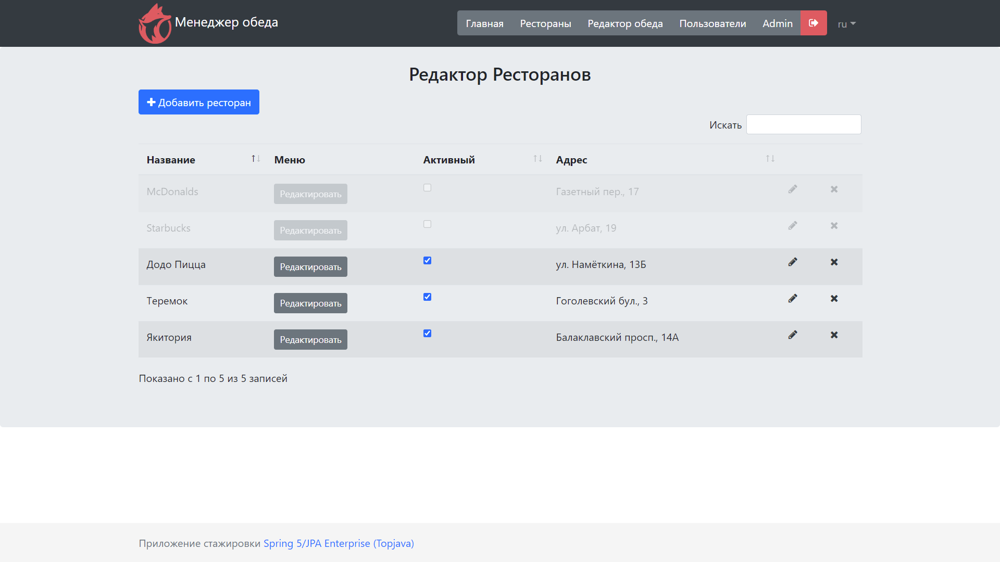
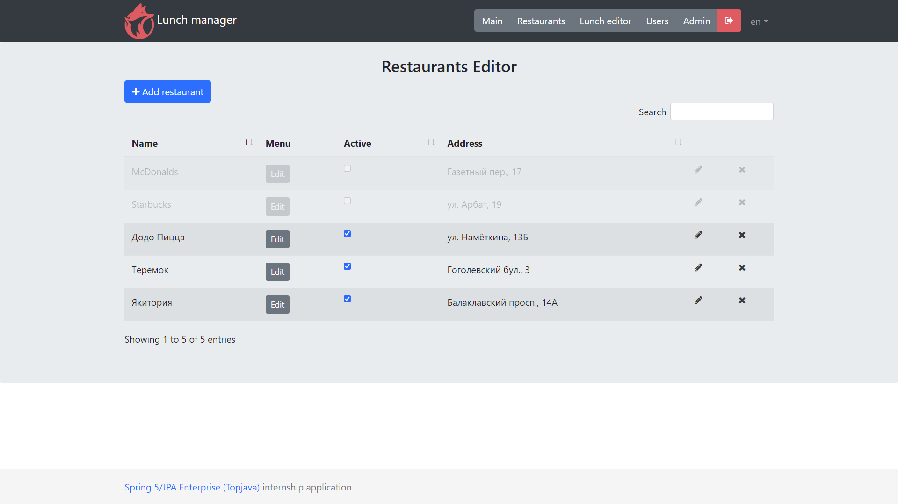

**EN** | [RU](README.md)

Lunch manager
===============================
[](https://www.codacy.com/gh/vladislav1is/lunch-manager-reboot/dashboard?utm_source=github.com&amp;utm_medium=referral&amp;utm_content=vladislav1is/lunch-manager-reboot&amp;utm_campaign=Badge_Grade)

**Graduation internship project of** [Java Online Projects](https://javaops.ru/view/topjava)
- Source code taken from **TopJava**;
- **Lunch manager** was based on this repository;
- Run in root directory: **mvn spring-boot:run**.

-----
## The task is
Design a Java Enterprise project with registration / authorization and access rights according to roles (USER, ADMIN, R_ADMIN).
Implement JSON API using Spring Data JPA / Hibernate / Spring MVC (or Spring Boot).
Cover all REST interfaces with JUnit tests using Spring MVC Test and Spring Security Test.

>**Build a voting system for deciding where to have lunch.**
>* 2 types of users: admin and regular users
>* Admin can input a restaurant and it's lunch menu of the day (2-5 items usually, just a dish name and price)
>* Menu changes each day (admins do the updates)
>* Users can vote on which restaurant they want to have lunch at
>* Only one vote counted per user
>* If user votes again the same day:
>   - If it is before 11:00 we assume that he changed his mind.
>   - If it is after 11:00 then it is too late, vote can't be changed
>
>Each restaurant provides new menu every day.
> 
>As a result, provide a link to github repository. It should contain the code, README.md with API documentation and couple curl commands to test it.

P.S.: Assume that your API will be used by a frontend developer to build frontend on top of that.

-----
## Implementation
The voting system helps to choose location for lunch.
**Each restaurant provides a new menu every day.**

> * **3 types of users: admin, manager and regular user**
>* Admin and Manager can manage restaurant and menu of the day (usually 2-5 items)
>* Manager manages only his own restaurants
>* Admin can create/edit/delete users
>* User can manage his profile data via UI (AJAX) and REST with basic authorization
>* **Menu changes every day (updated by admins)**
>* Dishes can be filtered by date
>* User can chose restaurant where he will lunch
>* **Only one vote counts per user**
>* If the user votes again on the same day:
>   - If **before 11:00**, we assume he changed his mind
>   - If it's late **after 11:00**, the vote cannot be changed
>* Restaurant row color **depends on user's daily vote (restaurant parameter)**

#### Restaurant
Restaurant information.
> You can't create two restaurants with same name and address.

#### Dish
Menu item.
> You can't create two dishes with same name and date.

#### User
Service user.
> You can't register two users with same email address.

#### Role
User rights can be extended by installing one of the existing admin roles:
- **USER** - registers on the service, edits his profile and chooses a Restaurant during an open survey.
- **ADMIN** - creates/edits/deletes Users, Menus.
- **R_ADMIN** - creates/edits/deletes Menus in his restaurants.
> **ADMIN** and **R_ADMIN** can perform actions available to **USER**.

#### Vote
Designed to register the User's vote, which he gave for selected Restaurant during the unfinished Poll.
>You can vote during the Poll in progress **(by default - until 11:00)**. If User votes a second time, his previous vote will be overwritten.

----
### Technology Stack
-   [Spring Boot](https://spring.io/projects/spring-boot)
-   [Spring Data JPA](http://projects.spring.io/spring-data-jpa)
-   [Spring Web MVC](https://docs.spring.io/spring-framework/docs/current/reference/html/web.html)
-   [Spring Data REST](https://spring.io/projects/spring-data-rest)
-   [Spring REST Docs](https://spring.io/projects/spring-restdocs)
-   [Spring Security](http://projects.spring.io/spring-security)
-   [Hibernate ORM](http://hibernate.org/orm)
-   [Hibernate Validator](http://hibernate.org/validator)
-   [H2](https://www.h2database.com)
-   [PostgreSQL](http://www.postgresql.org)
-   [Caffeine](https://github.com/ben-manes/caffeine/wiki)
-   [Liquibase](https://www.liquibase.org)
-   [SLF4J](http://www.slf4j.org)
-   [Apache Tomcat](http://tomcat.apache.org)
-   [JSP](http://ru.wikipedia.org/wiki/JSP)
-   [JSTL](http://en.wikipedia.org/wiki/JavaServer_Pages_Standard_Tag_Library)
-   [Json Jackson](https://github.com/FasterXML/jackson)
-   [JUnit 5](https://junit.org/junit5)
-   [Hamcrest](http://hamcrest.org/JavaHamcrest)
-   [AssertJ](https://assertj.github.io/doc/)
-   [Lombok](https://projectlombok.org)
-   [MapStruct](https://mapstruct.org)
-   [WebJars](http://www.webjars.org)
-   [jQuery](http://jquery.com)
-   [jQuery plugins](https://plugins.jquery.com)
-   [DataTables](http://datatables.net)
-   [Bootstrap](http://getbootstrap.com)

----
### Description (API)
Credentials:
```
User:  user@yandex.ru / password

Admin: admin@gmail.com / admin

Manager: r_admin@gmail.com / radmin
```
curl samples (application deployed at application context `lunch-manager-reboot`).
> For windows use `Git Bash`

[REST API documentation](http://localhost:8080/lunch-manager-reboot/swagger-ui.html)

-----
### Localization

- #### Russian (ru)


- #### English (en)


----

### Security
The application uses **BASIC authentication**. Users are divided into three types according to Roles:
>- **administrators**
>
>- **managers**
>
>- **users**

----
### Profiles
Application supports 3 profiles: **prod**, **dev** и **test**.

>- **prod** - designed for deployment on Heroku. Uses PostgreSQL database (see **application-prod.yml**).
>
>
>- **dev** - designed for development. Uses an in-memory H2 database (see **application-dev.yml**).
>
>
>- **test** - designed to run tests. Uses an in-memory H2 database (see **application-test.yaml**).

The required profile is specified by the **spring.profiles.active** parameter in **application.yaml** or
as JVM option **-Dspring.profiles.active=prod** on application startup (see file **hr.bat**).

----
### Launch application
Requires installation:
- [JDK](https://www.oracle.com/java/technologies/downloads/#java17) 17+
- [Git](https://git-scm.com/)
- [Maven](https://maven.apache.org/)

Enter commands into command line:
```
git clone https://github.com/vladislav1is/lunch-manager-reboot.git
cd lunch-manager-reboot
mvn spring-boot:run
```
Then go to [http://localhost:8080/lunch-manager-reboot](http://localhost:8080/lunch-manager-reboot)

----
### Application demo on Heroku
Demo users:
- **User:** user@yandex.ru / password
- **Admin:** admin@gmail.com / admin
- **Manager:** r_admin@gmail.com / radmin

[http://lunch-manager-reboot.herokuapp.com](http://lunch-manager-reboot.herokuapp.com)